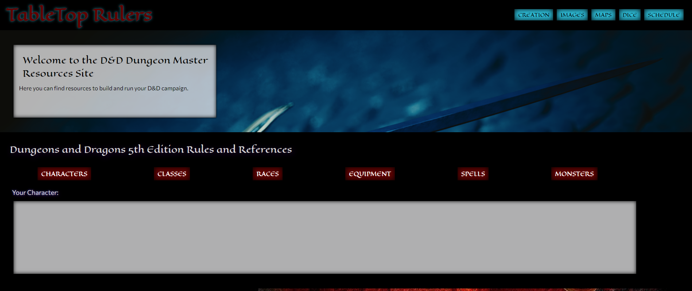

# Table Top Resource

* As a Dungeon Master (DM) it would be nice to have a one stop shop for everything from rules and resources to world building, dice rolling, and scheduling tools.

# Table of Contents

 Table of contents

 * [About the Project](#About-The-Project)
    * [Built With](#built-with)
* [Sections](#sections)
    * [Character List](#Character-list)
    * [Images](#images)
    * [Map](#map)
    * [Dice](#dice)
    * [Schedule](#schedule)

* [Usage](#usage)
    * [Pictures](#pictures)

* [Link to Page](#link-to-page)

* [Contact](#contact-us)
    * [Creators](#creators)

 
 
 
 

# About The Project

* AS a DM it would be convenient to have a single app to do everything needed to conduct/run a new campaign.
* GIVEN you are using this resource to build and run your D&D adventure.
* WHEN you load the page,
* THEN you are presented with links to multiple resources.
* WHEN you and your players click one of the resources,
* THEN you will be taken to that section of the page.
* WHEN you and your players arrive at the Dungeons and Dragons 5th Edition rules and references section,
* THEN you will find drop down menus with all of the information contained within the Player's Handbook of 5th Edition D&D. 
* WHEN you arrive at the character/world images and videos,
* THEN you will be able to type and search for images and videos.
* WHEN you and your players arrive at the maps section,
* THEN you will be able to download pre-built maps or click to create your own.
* WHEN you arrive on the map building tool,
* THEN you and your players will be presented with monsters, character tokens, and terrain to create, play on, and save your own custom maps.
* WHEN you and your players arrive at the dice roller,
* THEN you will be able to select your desired die value and roll as many dice as you need.
* WHEN you and your players arrive at the schedule section,
* THEN you will be able to schedule, delete, or change you and your players available times and dates to run the campaign.

 
 
 

## Built With
 * HTML
 * CSS 
 * JavaScript
 * [jQuery](https://jquery.com/)
 * [HTML2Canvas](https://html2canvas.hertzen.com/)
 * [D&D 5e API](https://www.dnd5eapi.co/)
 * [Pixabay](https://pixabay.com/)

 
 
 

# Sections

## Rules and Resources
* Using the rules and resources you can create your character while searching and looking up any character trait, class, race, equipment, spells, and even monster data.

## Images
* With the images section you will be able to type and search for any image/video that you may need to assist in the world building and running of your campaign!

## Map
* Using the map section you will be able to download maps or go to another page where you can build your map. Design your map any way you would like with monsters, and terrain. You can then download your map or play live on the page with your players.

## Dice
* With the Dice section you will be able to generate as many dice as you need to roll for your turn. Select dice from a d4 up to a d100!

## Schedule

* With the schedule section you will be able to set a weekly schedule in a four hour block on specific days that you and your group choose. All you need to do is select a time, select a day, and type your name and then it will be saved to the calendar within your local storage. Make sure you stick to your scheduled time!

 
 
 

# Usage

## Pictures

 
 
 

# Link to Page

* [Follow this Link to page](https://cgsdesign.github.io/table-top-resource/)

 
 
 

# Contact Us

## Creators
 

* **Aaron Geiger** [GitHub](https://github.com/geigea84), [geigea84@gmail.com](mailto:geigea84@gmail.com)

* **Brent Johnson** [GitHub](https://github.com/uberbrent), [brentjohnsondev@gmail.com](mailto:brentjohnsondev@gmail.com)

* **Catherine Sibley** [GitHub](https://github.com/cgsdesign), [catherine.lea.graham@gmail.com](mailto:catherine.lea.graham@gmail.com)

* **Darryl Simpson** [GitHub](https://github.com/DarrylSimpson) , [Darryl.Simpson0793@gmail.com](mailto:Darryl.Simpson0793@gmail.com)

