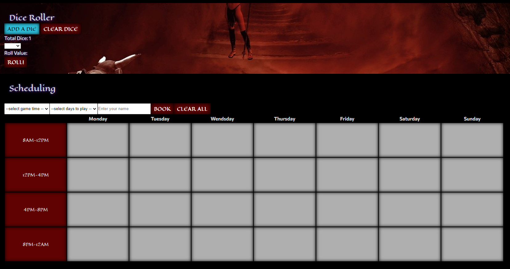

# Table Top Resource

* As a Dungeon Master (DM) it would be nice to have a one stop shop for everything from character creation, scheduling when everyone can play, and even map creation.

# Table of Contents

 Table of contents

 * [About the Project](#About-The-Project)
    * [Built With](#built-with)
* [Sections](#sections)
    * [Character List](#Character-list)
    * [Images](#images)
    * [Map](#map)
    * [Dice](#dice)
    * [Schedule](#schedule)

* [Usage](#usage)
    * [Pictures](#pictures)

* [Link to Page](#link-to-page)

* [Contact](#contact-us)
    * [Creators](#creators)

 
 
 
 

# About The Project

* AS a DM it would be convienient to have a single app to do everything needed to conduct/run a new campaign.
* GIVEN you are using this resource to build and run your DnD adventure.
* WHEN you load the page.
* THEN you are presented with a header with multiple seciton titles.
* WHEN you click one of the section titles.
* THEN you will be taken to that seciton on the page.
* WHEN you scroll down
* THEN you will be presented first with the 5th edition rules and references. 
* WHEN you hover over one of the options.
* THEN there will be a drop down of more information for you to refrence during your campaign creation.
* WHEN on the 'Find Character and World Images' section.
* THEN you will be able to type and search for images.
* WHEN you click the build your own map section.
* THEN you will be able to build and save your own custom map.
* WHEN presented with the dice. 
* THEN you will be able to add, subtract and roll any amount of dice chosen up to d100.
* WHEN presented with the schedule section.
* THEN you will be able to schedule your time that you and your friends could meet to run the campaign.

 
 
 

## Built With
 * [jQuery](https://jquery.com/)
 * HTML
 * CSS 
 * JavaScript

 
 
 

# Sections

## Character List
* Using the character list you can create your character while searching and looking up any character trait, class, race, equitment, spells, and even monster data.

## Images
* With the images section you will be able to type and search for any image that you may need to assist in the creation and running of your campaign!

## Map
* Using the map section you will be taken to another page where you can set your map. Design your map any way you would like with monsters, and terrain. You are able to save the map, clear the map and also return to the main page, and if you want you could also save the image of the map onto your local computer!

## Dice
* With the Dice section you will be able to generate as many die as you need to take a turn. (up to 10 dice!) Select dice from a d4 up to a d100!

## Schedule

* With the schedule section you will be able to set a weekly schedule in a four hour block on specific days that you and your group chooses. All you need to do is select a time, select a day, and type your name and then it will be saved to the calendar. Make sure you stick to your scheduled time!

 
 
 

# Usage

## Pictures

 
 
 

# Link to Page

* [Follow this Link to page](https://cgsdesign.github.io/table-top-resource/index.html)

 
 
 

# Contact Us

## Creators
 

* **Aaron Geiger** [GitHub](https://github.com/geigea84), [geigea84@gmail.com](mailto:geigea84@gmail.com)

* **Brent Johnson** [GitHub](https://github.com/uberbrent), [brentjohnsondev@gmail.com](mailto:brentjohnsondev@gmail.com)

* **Catherine Sibley** [GitHub](https://github.com/cgsdesign), [catherine.lea.graham@gmail.com](mailto:catherine.lea.graham@gmail.com)

* **Darryl Simpson** [GitHub](https://github.com/DarrylSimpson) , [Darryl.Simpson0793@gmail.com](mailto:Darryl.Simpson0793@gmail.com)

